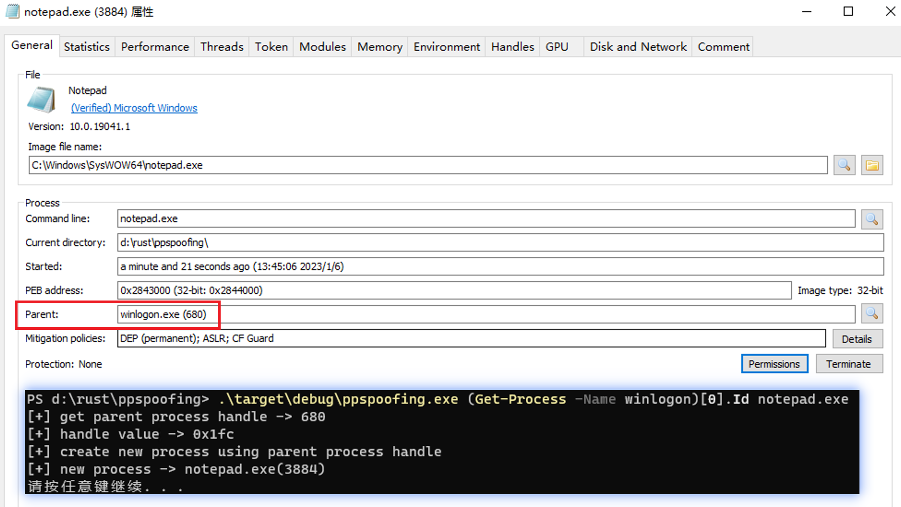

# ppspoofing

父进程 PID 伪造技术测试用，rust 编写。

## 使用方式

```bash
cargo build
cargo run -- <pid> <commandline>
```

在 powershell 可以这么用：

```powershell
ppspoofing.exe (Get-Process -Name winlogon)[0].Id notepad.exe
```



## 利用原理

1. 首先通过 OpenProcess 获取到目标进程句柄，访问权限 PROCESS_ALL_ACCESS
2. 创建 STARTUPINFOEXA，调用 InitializeProcThreadAttributeList 初始化
3. 调用 UpdateProcThreadAttribute 将第一步获取的句柄值更新到 PROC_THREAD_ATTRIBUTE_PARENT_PROCESS
4. 调用 CreateProcess 创建进程，创建标志为 CREATE_UNICODE_ENVIRONMENT | EXTENDED_STARTUPINFO_PRESENT

## 存在的问题

1. 在第一步，administrator 用户也无法获取到所有访问权限的 PPL 进程，影响不大，怎么解决自己研究一下
2. 某些进程作为父进程时，创建的 cmd.exe 进程会闪退，没查原因，创建notepad.exe 就不会有问题
